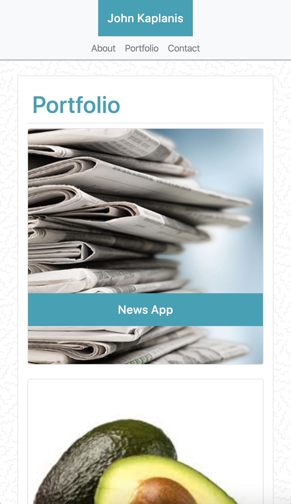
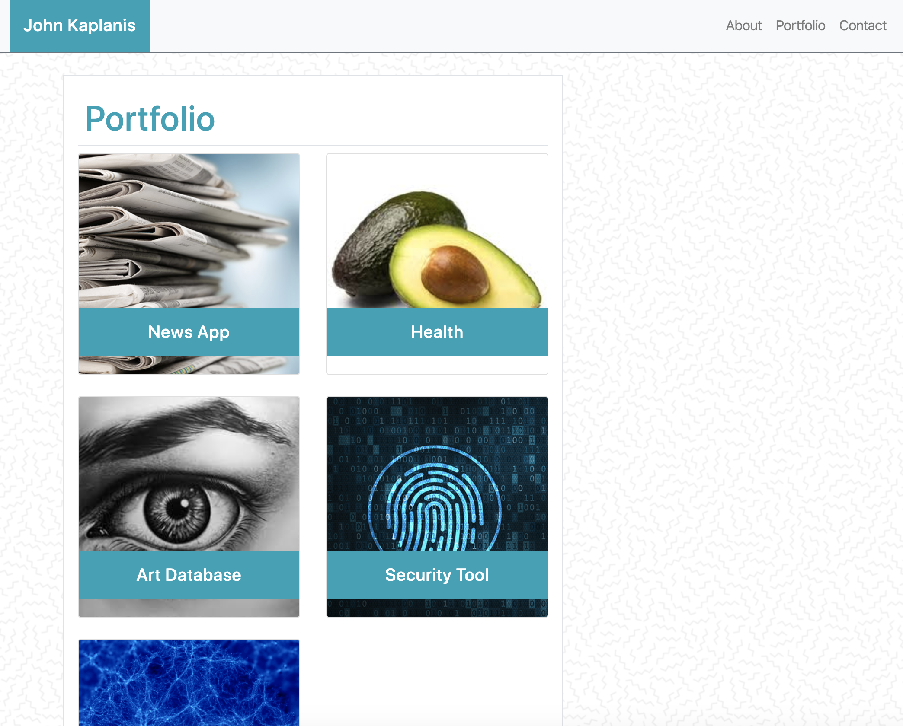

# Bootstrap Responsive Portfolio

Bootstrap is an open source toolkit for developing with HTML, CSS, and JS.

## Project Details

The goal of this project is to create a mobile responsive portfolio website using Bootstrap. 

## Links

Live page: https://jkaplanis.github.io/bootstrap-responsive-portfolio/
Github Repo: https://github.com/jkaplanis/bootstrap-responsive-portfolio

## Screenshots 

